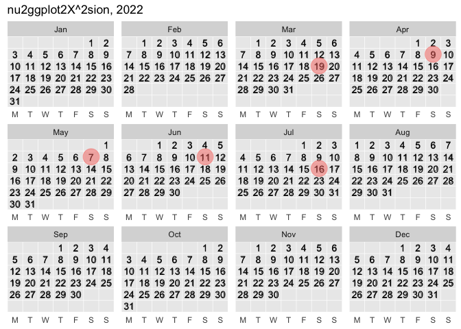

<!-- README.md is generated from README.Rmd. Please edit that file -->

# ggcalendar

<!-- badges: start -->
<!-- badges: end -->

Create grammatical calendars.

``` r
# install.packages("devtools")
devtools::install_github("EvaMaeRey/ggcalendar")
```

## Example

This is a basic example which shows you how to solve a common problem:

``` r
library(ggcalendar)
library(ggplot2)
#> Warning: package 'ggplot2' was built under R version 3.6.2
library(lubridate)
#> Warning: package 'lubridate' was built under R version 3.6.2
#> 
#> Attaching package: 'lubridate'
#> The following objects are masked from 'package:base':
#> 
#>     date, intersect, setdiff, union
library(tidyverse)
#> ── Attaching packages ─────────────────────────────────────── tidyverse 1.3.0 ──
#> ✓ tibble  3.1.6     ✓ dplyr   1.0.8
#> ✓ tidyr   1.0.2     ✓ stringr 1.4.0
#> ✓ readr   1.3.1     ✓ forcats 0.5.0
#> ✓ purrr   0.3.4
#> Warning: package 'tibble' was built under R version 3.6.2
#> Warning: package 'purrr' was built under R version 3.6.2
#> Warning: package 'dplyr' was built under R version 3.6.2
#> ── Conflicts ────────────────────────────────────────── tidyverse_conflicts() ──
#> x lubridate::as.difftime() masks base::as.difftime()
#> x lubridate::date()        masks base::date()
#> x dplyr::filter()          masks stats::filter()
#> x lubridate::intersect()   masks base::intersect()
#> x dplyr::lag()             masks stats::lag()
#> x lubridate::setdiff()     masks base::setdiff()
#> x lubridate::union()       masks base::union()
## basic example code

ggplot(data = return_dates_year(2022)) + 
  aes(date = date) + 
  facet_wrap(~month(date)) + 
  geom_point_calendar()
```


