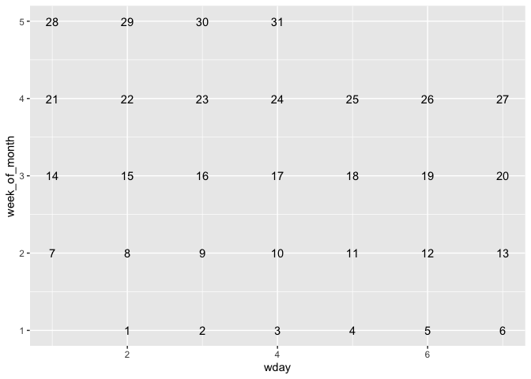
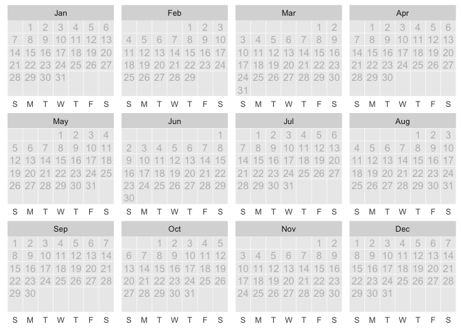
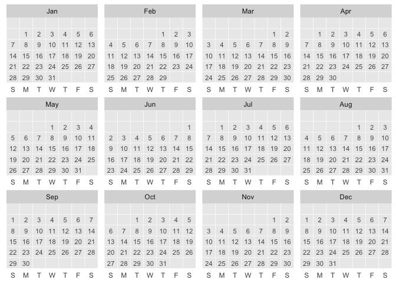
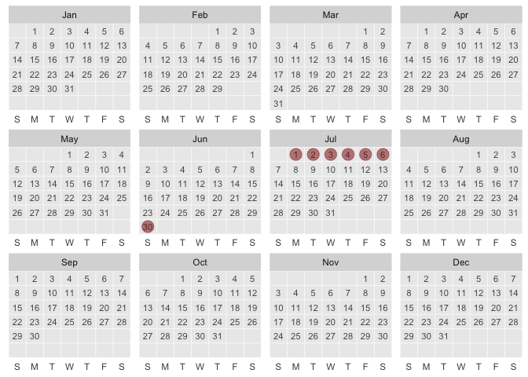
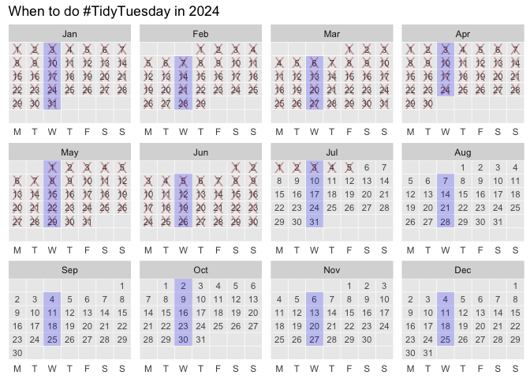
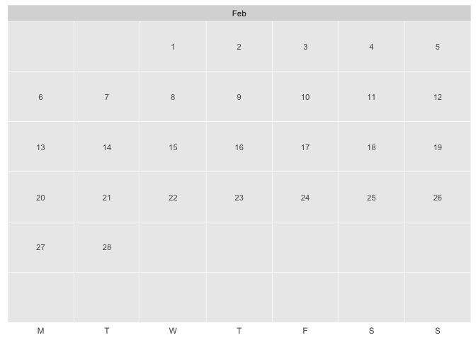
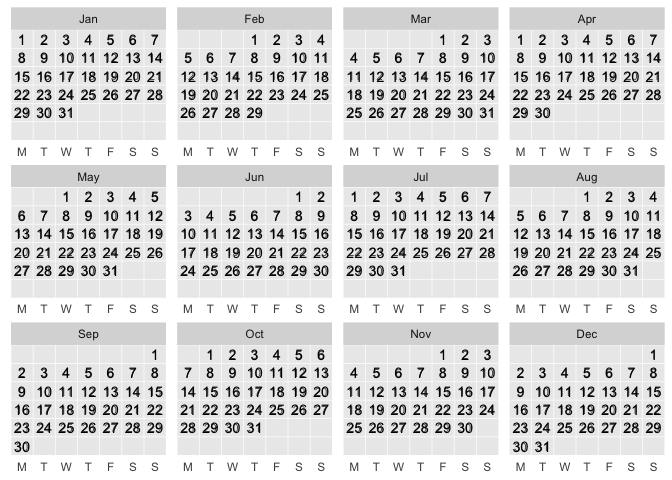
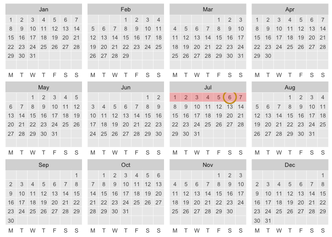

  - [ggcalendar](#ggcalendar)
  - [Step 00. Convenience functions, dates vectors to data
    frames.](#step-00-convenience-functions-dates-vectors-to-data-frames)
      - [Examples](#examples)
  - [Step 1 & 2. Compute: from date to x/y, & define
    StatCalendar](#step-1--2-compute-from-date-to-xy--define-statcalendar)
      - [Test it out](#test-it-out)
  - [Step 3. Let’s write a user-facing function
    `stat_calendar()`](#step-3-lets-write-a-user-facing-function-stat_calendar)
      - [Test `stat_calendar`](#test-stat_calendar)
  - [aliasing and convenience](#aliasing-and-convenience)
  - [`defaults_calendar` & `ggcalendar()` Thinking about set of
    scales/coords etc, that gives you a nice calendar (to wrap up into
    defaults)](#defaults_calendar--ggcalendar-thinking-about-set-of-scalescoords-etc-that-gives-you-a-nice-calendar-to-wrap-up-into-defaults)
      - [`defaults_calendar` &
        `ggcalendar()`](#defaults_calendar--ggcalendar)
      - [More](#more)
  - [NYC flights Example](#nyc-flights-example)
  - [Births example](#births-example)
  - [data defaults to calendar year and aes(date =
    date)](#data-defaults-to-calendar-year-and-aesdate--date)
  - [Minimal Viable Packaging](#minimal-viable-packaging)
  - [Traditional README](#traditional-readme)
  - [more ideas](#more-ideas)

<!-- README.md is generated from README.Rmd. Please edit that file -->

# ggcalendar

<!-- badges: start -->

[](https://lifecycle.r-lib.org/articles/stages.html#experimental)
<!-- badges: end -->

*Note: This README walks through package rational and contains the code
that defines proposed package functions and in addition to first-cut
testing. [TLDR - Jump to traditional readme
content](#traditional-readme)*

Here’s a proposal for creating calendars with ggplot2 via Stat
extension.

When using calendars, ‘when?’ and ‘where?’ are the same question\! So,
ggcalendar introduces a new positional aesthetic: ‘date’. Let’s *put*
things on the calendar\!

In this proposed package, we’ll specify the position of a calendar event
calendar using dates as the required aesthetic: `aes(date =
my_variable_of_dates)`\! Then you can use layers function
`stat_calendar()` and derivative geom functions `geom_text_calendar`,
`geom_tile_calendar` and `geom_point_calendar` to place specific
grobs/mark in the plot space.

Under the hood, the compute\_group functions finds the x and y position
for the date in the month (x is day in week and y is week in month).
Faceting by month is used to prevent over-plotting.

Other possible directions would be to calculate x and y based on date in
month *and* on month - instead of relying on faceting by month.
Furthermore, a dedicated Coord could be created (Teun’s thought). Then
maybe dates would just feed generically in as the ‘x’ aes - this sounds
cool\!

``` r
# library(ggcalendar)
library(ggplot2)
library(lubridate)
library(tidyverse)
```

``` r
# install.packages("devtools")
devtools::install_github("EvaMaeRey/ggcalendar")
```

# Step 00. Convenience functions, dates vectors to data frames.

Because ggplot2’s diet is consists solely of dataframes, we create a
number of convenience functions that will help us produce dataframes
with column ‘date’ we can feed into ggplot2.

``` r
knitrExtra:::chunk_to_r("df_functions")
```

``` r
df_today <- function(){

  data.frame(date = Sys.Date())

}

df_day <- function(date = NULL){
  
  if(is.null(date)){date <- Sys.Date()}

  data.frame(date = date)

}


df_dates_interval <- function(start_date, end_date){

  data.frame(date = as.Date(start_date):as.Date(end_date) |>
    as.Date())

}

df_month <- function(month = NULL, year = NULL){

  if(is.null(month)){
    
    date <- Sys.Date()
    month <- lubridate::month(date) 
  }
   
  if(is.numeric(month)){ 
    
    month <- stringr::str_pad(month, width = 2, pad = "0")
    
  }
  
    if(is.null(year)){
    
    date <- Sys.Date()
    year <- lubridate::year(date)
    }

  
  paste0(year,"-", month, "-01") |>
    lubridate::as_date() ->
    start_date

  start_date |> lubridate::ceiling_date(unit = "month") ->
    end_date

    data.frame(date = 
                 df_dates_interval(start_date, 
                                       end_date - lubridate::days(1)))

}

df_week <- function(date = NULL){

  if(is.null(date)){date <- Sys.Date()}

  start_date <- lubridate::floor_date(date, unit = "week")
  end_date <- lubridate::ceiling_date(date, unit = "week")

  data.frame(date = df_dates_interval(start_date, 
                        end_date - lubridate::days(1)) )

}

return_df_hours_week <- function(date = NULL){

  if(is.null(date)){date <- Sys.Date()}

  start_date <- lubridate::floor_date(date, unit = "week")

  data.frame(date = (start_date + lubridate::hours(1:(24*7-1))))

}

df_year <- function(year = NULL){

  if(is.null(year)){year <-  lubridate::year(Sys.Date())}

  paste0(year, "-01-01") |>
    lubridate::as_date() ->
  start_date

  start_date |> lubridate::ceiling_date(unit = "year") ->
    end_date

    data.frame(date = 
                 df_dates_interval(start_date, 
                                       end_date - lubridate::days(1)))
    
}
```

## Examples

Let’s have a look at some of these.

``` r
df_today()
#>         date
#> 1 2024-05-16

df_day()
#>         date
#> 1 2024-05-16

df_dates_interval(start_date = "2024-10-02", end_date = "2024-10-04")
#>         date
#> 1 2024-10-02
#> 2 2024-10-03
#> 3 2024-10-04

df_week()
#>         date
#> 1 2024-05-12
#> 2 2024-05-13
#> 3 2024-05-14
#> 4 2024-05-15
#> 5 2024-05-16
#> 6 2024-05-17
#> 7 2024-05-18

df_year() |> head()
#>         date
#> 1 2024-01-01
#> 2 2024-01-02
#> 3 2024-01-03
#> 4 2024-01-04
#> 5 2024-01-05
#> 6 2024-01-06

df_month() |> head()
#>         date
#> 1 2024-05-01
#> 2 2024-05-02
#> 3 2024-05-03
#> 4 2024-05-04
#> 5 2024-05-05
#> 6 2024-05-06

return_df_hours_week() |> head()
#>                  date
#> 1 2024-05-12 01:00:00
#> 2 2024-05-12 02:00:00
#> 3 2024-05-12 03:00:00
#> 4 2024-05-12 04:00:00
#> 5 2024-05-12 05:00:00
#> 6 2024-05-12 06:00:00
```

# Step 1 & 2. Compute: from date to x/y, & define StatCalendar

The computation that we want to be done under the hood relates to
translating the here-to-fore unknown positional aesthetic ‘date’ to the
first-class ‘x’ and ‘y’ positional aesthetic mappings, as well as
variables that can be used in faceting (month).

``` r
knitrExtra:::chunk_to_r("get_week_of_month")
```

As a pre-step to computing many useful variables from our date variable,
we focus on this (currently messy) conversion of vectors of dates to
week of the month.

``` r
get_week_of_month <- function(x){
  
  (- lubridate::wday(x) + lubridate::day(x)) %/% 
    7 + 1 +
    ifelse(lubridate::wday(lubridate::floor_date(lubridate::as_date(x), "month")) == 1, 0, 1)
  
}
```

Next, we’ll define a compute group function. A number of variables are
created by parsing our date variable.

Then, we’ll pass all this computation to define a new ggproto object
StatCalendar. For maximum flexibility, our compute function doesn’t
create ggplot2 core aesthetic channels ‘x’, ‘y’, and ‘label’ variables,
but instead uses the default\_aes field to state what should be first
interpreted as x, y and label (thoughts? Maybe only ‘label’ should be
managed like this).

``` r
knitrExtra:::chunk_to_r("compute_group_calendar")
```

``` r
compute_group_calendar <- function(data, scales){

  data |>
    dplyr::mutate(wday = lubridate::wday(.data$date)) |>
    dplyr::mutate(wday_abbr = lubridate::wday(.data$date, label = TRUE, abbr = TRUE)) |>
    dplyr::mutate(week_of_month = get_week_of_month(.data$date)) |>
    dplyr::mutate(day = lubridate::day(.data$date)) |>
    dplyr::mutate(year = lubridate::year(.data$date) - 2018) |>
    dplyr::mutate(month_abbr = lubridate::month(.data$date, abbr = TRUE, label = TRUE)) |>
    dplyr::mutate(hour = lubridate::hour(.data$date)) |>
    dplyr::mutate(year_academic =  lubridate::year(.data$date) +
                    ifelse(lubridate::month(date) >
                             6, 1, 0)) |>
    dplyr::mutate(month_academic_abbr = .data$month_abbr |>
                    factor(levels = c("Jul", "Aug", "Sep", "Oct", "Nov", "Dec",
                                      "Jan", "Feb", "Mar", "Apr", "May", "Jun")))

}

StatCalendar <- ggplot2::ggproto(`_class` = "StatCalendar",
                                 `_inherit` = ggplot2::Stat,
                                 required_aes = c("date"),
                                 compute_group = compute_group_calendar,
                                 default_aes = ggplot2::aes(x = ggplot2::after_stat(wday),
                                                            y = ggplot2::after_stat(week_of_month),
                                                            label = ggplot2::after_stat(day)))


StatWeekly <- ggplot2::ggproto(`_class` = "StatCalendar",
                               `_inherit` = ggplot2::Stat,
                               required_aes = c("date"),
                               compute_group = compute_group_calendar,
                               default_aes = ggplot2::aes(x = ggplot2::after_stat(wday),
                                                          y = ggplot2::after_stat(hour),
                                                          label = ggplot2::after_stat(hour)))
```

## Test it out

Okay, let’s see how our compute and Stat work in action\!

``` r
df_week() |>
  compute_group_calendar()
#>         date wday wday_abbr week_of_month day year month_abbr hour
#> 1 2024-05-12    1       Sun             3  12    6        May    0
#> 2 2024-05-13    2       Mon             3  13    6        May    0
#> 3 2024-05-14    3       Tue             3  14    6        May    0
#> 4 2024-05-15    4       Wed             3  15    6        May    0
#> 5 2024-05-16    5       Thu             3  16    6        May    0
#> 6 2024-05-17    6       Fri             3  17    6        May    0
#> 7 2024-05-18    7       Sat             3  18    6        May    0
#>   year_academic month_academic_abbr
#> 1          2024                 May
#> 2          2024                 May
#> 3          2024                 May
#> 4          2024                 May
#> 5          2024                 May
#> 6          2024                 May
#> 7          2024                 May

df_month() |>
  ggplot() + 
  aes(date = date) + 
  layer(stat = StatCalendar, geom = "text", 
        position = "identity")
```



# Step 3. Let’s write a user-facing function `stat_calendar()`

``` r
knitrExtra:::chunk_to_r("a_stat_calendar")
```

``` r
stat_calendar <- function(mapping = NULL, 
                          data = NULL,
                          geom = "text",
                          position = "identity", 
                          na.rm = FALSE,
                          show.legend = NA,
                          inherit.aes = TRUE, ...) {
  ggplot2::layer(
    stat = StatCalendar, # proto object from Step 2
    geom = geom, # inherit other behavior
    data = data,
    mapping = mapping,
    position = position,
    show.legend = show.legend,
    inherit.aes = inherit.aes,
    params = list(na.rm = na.rm, ...)
  )
}
```

### Test `stat_calendar`

``` r
df_year() |> 
  ggplot() + 
  aes(date = date) +
  stat_calendar(color = "grey") + 
  facet_wrap(~month(date, label = T,  abbr = T)) + 
  scale_y_reverse()
```


# aliasing and convenience

To give the user a better sense of what they’ll see when using
stat\_calendar we create the alias, ‘geom\_text\_calendar()’.

``` r
knitrExtra:::chunk_to_r("geom_text_calendar")
```

``` r
geom_text_calendar <- stat_calendar
geom_point_calendar <- function(...){stat_calendar(geom = "point", ...)}
geom_tile_calendar <- function(...){stat_calendar(geom = "tile", ...)}
```

# `defaults_calendar` & `ggcalendar()` Thinking about set of scales/coords etc, that gives you a nice calendar (to wrap up into defaults)

In our test of stat\_calendar, we see cumbersomeness. Below, we consider
even more ggplot2 decision that would make our plot easier to consume
and more beautiful.

``` r
day_labels = c("S", "M", "T", "W", "T", "F", "S")

df_year() |> 
  ggplot() + 
  aes(date = date) +
  stat_calendar(color = "grey") +
    ggplot2::aes(date = date) +
    ggplot2::scale_y_reverse(breaks = 5:0, 
                             expand = c(0,0), 
                             limits = c(6.5, 0.5)) +
    ggplot2::scale_x_continuous(breaks = 1:7, 
                                labels = day_labels,
                                limits = c(.5, 7.5), 
                                expand = c(0,0)
                                ) +
    ggplot2::facet_wrap(~lubridate::month(date, abbr = T, label = T), scales = "free") +
    ggplot2::labs(x = NULL, y = NULL) +
    ggplot2::theme(axis.text.y = ggplot2::element_blank(),
          axis.ticks.y = ggplot2::element_blank(),
          axis.ticks.x = ggplot2::element_blank()) +
    ggplot2::theme(panel.grid.major = ggplot2::element_blank()) + 
    ggplot2::geom_blank()
```



## `defaults_calendar` & `ggcalendar()`

Then, we bundle these up into defaults\_calendar, which can be quickly
added for converting to a more polished and readable calendar.

``` r
knitrExtra:::chunk_to_r("defaults_calendar")
```

``` r
defaults_calendar <- function(day_labels = c("S", "M", "T", "W", "T", "F", "S")){
  
  list(
    ggplot2::scale_y_reverse(breaks = 6:0, 
                             expand = c(0,0), 
                             limits = c(6.5, 0.5)),
    ggplot2::scale_x_continuous(breaks = 1:7, 
                                labels = day_labels,
                                limits = c(.5, 7.5), 
                                expand = c(0,0)
                                ),
    ggplot2::facet_wrap(~lubridate::month(date, abbr = T, label = T), scales = "free"),
    ggplot2::labs(x = NULL, y = NULL),
    ggplot2::theme(axis.text.y = ggplot2::element_blank(),
          axis.ticks.y = ggplot2::element_blank(),
          axis.ticks.x = ggplot2::element_blank()) +
    ggplot2::theme(panel.grid.major = ggplot2::element_blank()),
    ggplot2::geom_blank()
  )
  
}
```

Let’s check it out…

``` r
df_year(2018) |> 
  ggplot() +
  aes(date = date) + 
  stat_calendar() + 
  defaults_calendar()
```


Furthermore, we provide ggcalendar as an alternative point of entry into
the ggplot framework. The default data frame is even included (the
current calendar year), so a full calendar will print with no additional
specification.

``` r
knitrExtra:::chunk_to_r("ggcalendar")
```

``` r
ggcalendar <- function(dates_df = df_year(), 
                       day_labels = c("S", "M", "T", "W", "T", "F", "S"), 
                       labels_layer = TRUE, 
                       color = "grey35",
                       size = 3,
                       alpha = .5){

  if(labels_layer){my_layer <- stat_calendar(color = color, aes(date = date), size = size, show.legend = F)}else{my_layer <- NULL}
  
  ggplot2::ggplot(data = dates_df) +
  defaults_calendar(day_labels = day_labels) +
  ggplot2::aes(date = date) +
  my_layer

  }
```

Let’s check it out\!

``` r
ggcalendar()
```



``` r

ggcalendar() + 
  stat_calendar(geom = "point", 
                data = df_week(),
                color = "darkred",
                size = 5,
                alpha = .5)
```



## More

``` r
library(magrittr)
ggcalendar() +
   # remember default data in ggcalendar() is current year of dates
  aes(date = date) +
  geom_tile_calendar(data = . %>%  
                      filter(wday(date) == 3),  
                      fill = "blue",  
                      alpha = .2) +
  labs(title = "When to do #TidyTuesday in 2024") +
  stat_calendar(label = "X",
                color = "darkred",
                size = 5,
                data = df_dates_interval(
                  "2024/01/01", Sys.Date() - days(1)),
                 alpha = .35)
```



``` r
df_month(year = 2023, month = 2) |> 
  ggcalendar()
```



``` r

df_month(year = 2023, month = 2) |> 
ggcalendar()
```


``` r

df_month(year = 2023, month = 2) |> 
ggcalendar(labels_layer = F) + 
  aes(date = date) + 
  geom_text_calendar(label = "Another\nday...", # override default
                     size = 4)
```


``` r

df_month(year = 2023, month = 2) |> 
ggcalendar() + 
  aes(date = date) + 
  geom_text_calendar() + 
  geom_point_calendar(data = . %>% filter(wday(date) %in% 2:6),
                      alpha = .2,
                      size = 5,
                      color = "cadetblue") + 
  theme(panel.background = element_rect(fill = "beige"))
```


``` r

library(ggplot2)

df_dates_interval("2023-09-01", "2023-12-31") |> 
  ggcalendar()
```


``` r
## basic example code
c("2022-03-19", "2022-04-09", "2022-05-07", 
  "2022-06-11", "2022-07-16") %>% 
  tibble(date = .) |> 
  mutate(date = date %>% as_date) |> 
  mutate(future = Sys.Date() < date) ->
events

df_year(2022) |> 
  ggcalendar() +
  aes(date = date) +
  geom_text_calendar() + 
  geom_point_calendar(data = events,
                      aes(color = future),
                      size = 8, 
                      alpha = .5,
                      show.legend = F) +
  labs(title = "nu2ggplot2X^2sion, 2022")
```


# NYC flights Example

> Airline on-time data for all flights departing NYC in 2013. Also
> includes useful ‘metadata’ on airlines, airports, weather, and planes.

Data inspiration:
<https://twitter.com/rappa753/status/1545729747774308354> @rappa753

``` r

# example 
nycflights13::flights |> 
  ungroup() |> 
  mutate(date = as.Date(time_hour)) |> 
  filter(year(date) == 2013) |> 
  count(date) |> 
  ggcalendar() +
  aes(date = date) +
  geom_point_calendar(data = . %>% tibble(), aes(size = n, 
                          color = n), 
                      alpha = .7, show.legend = F) + 
  scale_color_viridis_c(option = "inferno", direction = 1) + 
  scale_size(range = c(3,8)) +
  geom_text_calendar(aes(label = n), size = 2) + 
  NULL
```


-----

# Births example

``` r
births <- "https://raw.githubusercontent.com/EvaMaeRey/tableau/9e91c2b5ee803bfef10d35646cf4ce6675b92b55/tidytuesday_data/2018-10-02-us_births_2000-2014.csv"

readr::read_csv(births) |> 
  mutate(month = stringr::str_pad(month, 2, pad = "0"),
         date_of_month = str_pad(date_of_month, 2, pad = "0")) |> 
  mutate(date = paste(year, month, date_of_month, sep = "-") |> as_date()) |> 
  filter(year == 2012) |> 
  ggcalendar() + 
  aes(date = date) + 
  geom_point_calendar(alpha = .4) +
  aes(size = births) +
  aes(color = births) +
  scale_color_viridis_c() +
  guides(
    colour = guide_legend("Births"),
    size = guide_legend("Births")
 ) + 
  geom_point_calendar(data = data.frame(date =
                                      as_date("2012-12-25")),
                      size = 5, color = "red", shape = 21)
```


-----

# data defaults to calendar year and aes(date = date)

The following feels a little weird to me, but is allowed.

A grammar of graphics fundamental is that a statistical graphic are
composed of geometries/marks that take on aesthetics (color, position,
size), to represent a variable.

Below we aren’t aren’t fully stating these specifications; which feels a
bit funny; I would not recommend this as a starting point.

``` r
ggcalendar() + 
 geom_text_calendar()
```



-----

``` r
contrast <- function(colour) {
  out   <- rep("grey35", length(colour))
  light <- farver::get_channel(colour, "l", space = "hcl")
  out[light < 50] <- "grey80"
  out
}
  
aes_autocontrast_color_on_fill <- aes(colour = after_scale(contrast(fill)))


nhl_player_births <- readr::read_csv('https://raw.githubusercontent.com/rfordatascience/tidytuesday/master/data/2024/2024-01-09/nhl_player_births.csv')


nhl_player_births |> 
  mutate(date = birth_date %>% 
           str_replace("....", "2024") %>% 
           as_date()) %>% 
  count(date) %>% 
  ggcalendar(labels_layer = F) +  # aes(date = date)  # local aes?
  aes(fill = n, label = n) + 
  aes_autocontrast_color_on_fill +
  geom_tile_calendar(alpha = .85, linewidth = 0, show.legend = F) + 
  scale_fill_viridis_c() +
  geom_text_calendar(size = 3) +
  labs(title = "Number of NHL Player Birthdays by day 1879-2005\nas celebrated in 2024")
```


-----

# Minimal Viable Packaging

``` r
# devtools::create(".")
usethis::use_package("lubridate")
usethis::use_package("ggplot2")
usethis::use_package("dplyr")
usethis::use_package("stringr")

devtools::check()
```

# Traditional README

``` r
library(ggcalendar)
library(tidyverse)

ggcalendar:::ggcalendar() + 
  labs(title = "Calendar: 2024")
```


``` r

ggcalendar:::ggcalendar() + 
  ggcalendar:::geom_tile_calendar(
    data = ggcalendar:::df_week(),
    fill = "red",
    alpha = .25) + 
  ggcalendar:::geom_point_calendar(
    data = ggcalendar:::df_today(),
    color = "goldenrod3", shape = 21,
    size = 8, stroke = 1.5
    )
```



``` r


# example 
nycflights13::flights |> 
  ungroup() |> 
  mutate(date = as.Date(time_hour)) |> 
  filter(year(date) == 2013) |> 
  count(date) |> 
  ggcalendar:::ggcalendar(labels_layer = FALSE) +
      aes(date = date) +
      ggcalendar:::geom_tile_calendar(
        aes(fill = n),
        alpha = .7, show.legend = F) + 
      scale_fill_viridis_c(option = "inferno", 
                            direction = 1) + 
      scale_size(range = c(3,8)) +
      ggcalendar:::geom_text_calendar(aes(label = n), 
                                      size = 2) + 
      NULL
```


``` r
## basic example code
ggcalendar:::df_month(month = "2022-07") |> 
  head()

ggcalendar::return_dates_interval(start_date = "2022-07-01", end_date = "2022-08-31") |> 
  ggcalendar() +
  aes(date = date) +
  geom_text_calendar(size = 8) + 
  geom_point_calendar(data = . %>% filter(date == "2022-07-04"),
                      size = 8, 
                      alpha = .5) +
  geom_point_calendar(data = . %>% filter(date < Sys.Date()),
                      size = 10, shape = "x")
```

-----

# more ideas

``` r
#' #' Title
#' #'
#' #' @param data
#' #' @param scales
#' #'
#' #' @return
#' #' @export
#' #'
#' #' @examples
#' #' return_dates_year(1999) %>%
#' #' head() %>%
#' #' compute_group_calendar()
#' #'
#' compute_group_weekly <- function(data, scales){
#'
#'   data %>%
#'     dplyr::mutate(num_day_of_week = lubridate::wday(.data$date)) %>%
#'     dplyr::mutate(day_of_week = lubridate::wday(.data$date, label = TRUE, abbr = TRUE)) %>%
#'     dplyr::mutate(week_of_month = (- lubridate::wday(.data$date) + lubridate::day(.data$date)) %/% 7 + 1 +
#'                     ifelse(lubridate::wday(lubridate::floor_date(lubridate::as_date(.data$date), "month")) == 1, -1, 0)
#'                   ) %>%
#'     dplyr::mutate(date_of_month = lubridate::day(.data$date)) %>%
#'     dplyr::mutate(which_year = lubridate::year(.data$date) - 2018) %>%
#'     dplyr::mutate(month = lubridate::month(.data$date, abbr = TRUE, label = TRUE)) %>%
#'     dplyr::mutate(hour = lubridate::hour(.data$date)) %>%
#'     dplyr::mutate(academic_year =  lubridate::year(.data$date) +
#'                     ifelse(lubridate::month(date) >
#'                              6, 1, 0)) %>%
#'     dplyr::mutate(academic_month = .data$month %>%
#'                     factor(levels = c("Jul", "Aug", "Sep", "Oct", "Nov", "Dec",
#'                                       "Jan", "Feb", "Mar", "Apr", "May", "Jun")))
#'
#' }
#'
#' StatWeekly <- ggplot2::ggproto(`_class` = "StatWeekly",
#'                                  `_inherit` = ggplot2::Stat,
#'                                  required_aes = c("date"),
#'                                  compute_group = compute_group_weekly,
#'                                  default_aes = ggplot2::aes(x = ggplot2::after_stat(day_of_week %>% as.numeric()),
#'                                                             y = ggplot2::after_stat(hour),
#'                                                             label = ggplot2::after_stat(date_of_month)))
#'
```

``` r
#' Title
#'
#' @param dates_df
#'
#' @return
#' @export
#'
#' @examples
#' library(lubridate)
#' library(dplyr)
#' library(ggplot2)
#' library(magrittr)
#'
#' ggweekly() +
#' geom_text_weekly()
#'
#' ggweekly() +
#' geom_text_weekly(color = "grey35") +
#' labs(title = "When to do #TidyTuesday in 2022") +
#' geom_text_weekly(label = "X",
#'                   data = data.frame(date = seq(as.Date("2022/01/01"),
#'                   as.Date("2022/04/18"), "days")))
#'
ggweekly <- function(dates_df = return_hours_week(), day_labels = c("S", "M", "T", "W", "T", "F", "S")){


  ggplot2::ggplot(data = dates_df) +
    ggplot2::aes(date = date) +
    ggplot2::scale_y_reverse(
      breaks = 7:21,
                             expand = c(0,0),
                             limits = c(21 + .5,
                                        7 - .5),

                             ) +
    ggplot2::scale_x_continuous(breaks = 1:7, labels = day_labels,
                                limits = c(.5, 7.5),expand = c(0,0)

                                #position = "top"
                                ) +
    ggplot2::facet_wrap(~epiweek(date), scales = "free") +
    ggplot2::labs(x = NULL, y = NULL) +
    ggplot2::theme(#axis.text.y = ggplot2::element_blank(),
          axis.ticks.y = ggplot2::element_blank(),
          axis.ticks.x = ggplot2::element_blank()) +
    ggplot2::theme(panel.grid.major = ggplot2::element_blank()) +
    ggplot2::geom_blank() +
    # theme(strip.placement = "outside") +
    NULL

}
```
