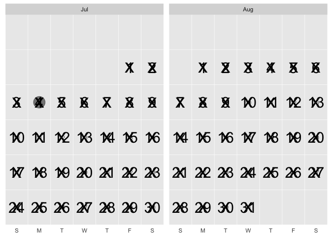

<!-- README.md is generated from README.Rmd. Please edit that file -->

# ggcalendar

<!-- badges: start -->

[](https://lifecycle.r-lib.org/articles/stages.html#experimental)
<!-- badges: end -->

Create grammar of graphics calendars.

``` r
library(ggcalendar)
library(ggplot2)
library(lubridate)
library(tidyverse)
```

``` r
# install.packages("devtools")
devtools::install_github("EvaMaeRey/ggcalendar")
```

## Example

``` r
ggcalendar() + # defaults to full calendar of current year
  geom_point_calendar() # default to dates declared in ggcalendar
```


``` r

ggcalendar() + 
  geom_text_calendar() # defaults to day of month in ggcalendar
```


``` r

ggcalendar() + 
  geom_text_calendar(label = "Day", # override default
                     size = 2)
```


``` r

ggcalendar() + 
  geom_text_calendar() + 
  geom_point_calendar(data = . %>% filter(wday(date) %in% 2:6),
                      alpha = .2,
                      size = 5,
                      color = "red")
```


``` r

## basic example code

c("2022-03-19", "2022-04-09", "2022-05-07", "2022-06-11", "2022-07-16") %>% 
  tibble(date = . ) %>% 
  mutate(date = date %>% as_date) %>% 
  mutate(future = Sys.Date() < date) ->
events

ggcalendar() +
  geom_text_calendar() + 
  geom_point_calendar(data = events,
                      aes(color = future),
                      size = 8, 
                      alpha = .5) +
  labs(title = "nu2ggplot2X^2sion")
```


``` r

## basic example code
ggcalendar::return_dates_month(month = "2022-07") %>% 
  head
#>         date
#> 1 2022-07-01
#> 2 2022-07-02
#> 3 2022-07-03
#> 4 2022-07-04
#> 5 2022-07-05
#> 6 2022-07-06

ggcalendar(ggcalendar::return_dates_interval(start_date = "2022-07-01", end_date = "2022-08-31")) +
  geom_text_calendar(size = 8) + 
  geom_point_calendar(data = . %>% filter(date == "2022-07-04"),
                      size = 8, 
                      alpha = .5) +
  geom_point_calendar(data = . %>% filter(date < Sys.Date()),
                      size = 10, shape = "x")
```



-----

# A little on the internals, the compute group function or thank you lubridate\!

``` r
compute_group_calendar_script <- readLines("./R/compute_group_calendar.R")
```

``` r
#' Title
#'
#' @param data
#' @param scales
#'
#' @return
#' @export
#'
#' @examples
#' return_dates_year(1999) %>%
#' head() %>%
#' compute_group_calendar()
#'
compute_group_calendar <- function(data, scales){

  data %>%
    dplyr::mutate(num_day_of_week = lubridate::wday(.data$date)) %>%
    dplyr::mutate(day_of_week = lubridate::wday(.data$date, label = TRUE, abbr = TRUE)) %>%
    dplyr::mutate(week_of_month = (- lubridate::wday(.data$date) + lubridate::day(.data$date)) %/% 7 + 1 +
                    ifelse(lubridate::wday(lubridate::floor_date(lubridate::as_date(.data$date), "month")) == 1, -1, 0)
                  ) %>%
    dplyr::mutate(date_of_month = lubridate::day(.data$date)) %>%
    dplyr::mutate(which_year = lubridate::year(.data$date) - 2018) %>%
    dplyr::mutate(month = lubridate::month(.data$date, abbr = TRUE, label = TRUE)) %>%
    dplyr::mutate(hour = lubridate::hour(.data$date)) %>%
    dplyr::mutate(academic_year =  lubridate::year(.data$date) +
                    ifelse(lubridate::month(date) >
                             6, 1, 0)) %>%
    dplyr::mutate(academic_month = .data$month %>%
                    factor(levels = c("Jul", "Aug", "Sep", "Oct", "Nov", "Dec",
                                      "Jan", "Feb", "Mar", "Apr", "May", "Jun"))) %>%
    dplyr::mutate(label = .data$date_of_month)

}

StatCalendar <- ggplot2::ggproto(`_class` = "StatCalendar",
                                 `_inherit` = ggplot2::Stat,
                                 required_aes = c("date"),
                                 compute_group = compute_group_calendar,
                                 default_aes = ggplot2::aes(x = ggplot2::after_stat(day_of_week),
                                                            y = ggplot2::after_stat(week_of_month)))
```

``` r
# compute function
return_dates_year(1999) %>%
head() %>%
compute_group_calendar()
#>         date num_day_of_week day_of_week week_of_month date_of_month which_year
#> 1 1999-01-01               6         Fri             0             1        -19
#> 2 1999-01-02               7         Sat             0             2        -19
#> 3 1999-01-03               1         Sun             1             3        -19
#> 4 1999-01-04               2         Mon             1             4        -19
#> 5 1999-01-05               3         Tue             1             5        -19
#> 6 1999-01-06               4         Wed             1             6        -19
#>   month hour academic_year academic_month label
#> 1   Jan    0          1999            Jan     1
#> 2   Jan    0          1999            Jan     2
#> 3   Jan    0          1999            Jan     3
#> 4   Jan    0          1999            Jan     4
#> 5   Jan    0          1999            Jan     5
#> 6   Jan    0          1999            Jan     6
```

## How used in geom\_point\_calendar… default aes

``` r
geom_point_calendar_script <- readLines("./R/geom_point_calendar.R")
```

``` r


#' Title
#'
#' @param mapping
#' @param data
#' @param position
#' @param na.rm
#' @param show.legend
#' @param inherit.aes
#' @param ...
#'
#' @return
#' @export
#'
#' @examples
#' library(lubridate)
#' library(tidyverse)
#'
#' data.frame(date = as.Date("2020-01-01") + days(0:365)) %>%
#'   ggplot() +
#'   aes(date = date) +
#'   aes(color = date) +
#'   geom_point_calendar() +
#'   facet_wrap(~month(date, label = TRUE, abbr = TRUE))
#'
#' data.frame(date = as.Date("2020-01-01") + days(0:400)) %>%
#'   ggplot() +
#'   aes(date = date) +
#'   geom_point_calendar() +
#'   facet_grid(year(date) ~ month(date, label = TRUE, abbr = TRUE))
geom_point_calendar <- function(mapping = NULL, data = NULL,
                               position = "identity", na.rm = FALSE,
                               show.legend = NA,
                               inherit.aes = TRUE, ...) {
  ggplot2::layer(
    stat = StatCalendar, # proto object from Step 2
    geom = ggplot2::GeomPoint, # inherit other behavior
    data = data,
    mapping = mapping,
    position = position,
    show.legend = show.legend,
    inherit.aes = inherit.aes,
    params = list(na.rm = na.rm, ...)
  )
}
```
